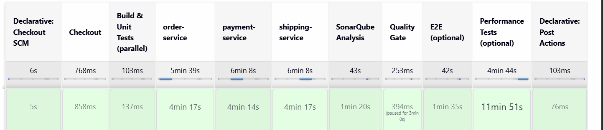
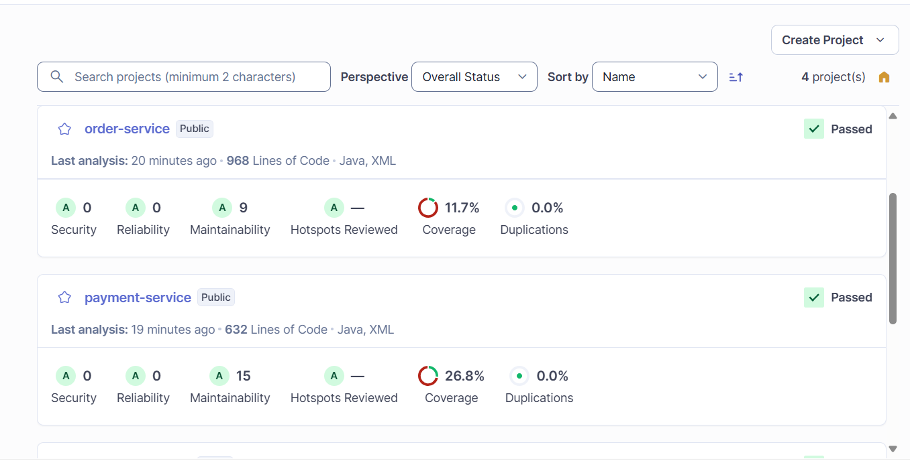
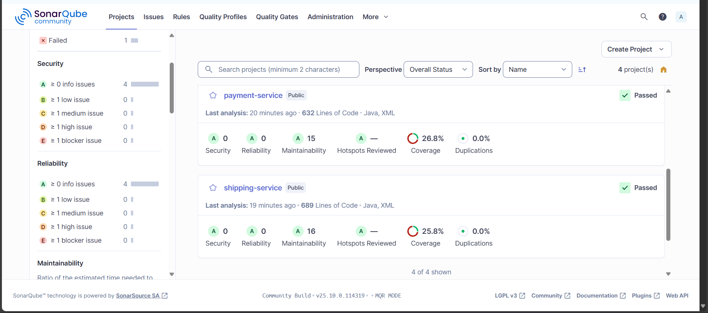

# Informe Técnico: Implementación de Pipeline CI/CD para Aplicación de Microservicios E-Commerce

**Proyecto:** ecommerce-microservice-backend-app  
**Fecha:** Noviembre 2025  
**Autor:** Felipe Rojas Prado

---

## 1. Resumen

Este documento describe la implementación completa de un pipeline CI/CD multi-etapa para una aplicación distribuida de microservicios e-commerce basada en Spring Boot. El pipeline abarca tres ambientes (DEV, STAGE, PROD) con integración de análisis estático de código, pruebas automatizadas, construcción de imágenes Docker, y despliegue en Kubernetes. La solución implementada permite entregas continuas con validación automática de calidad y estrategias de rollback ante fallos.

---

## 2. Objetivos del Proyecto

### 2.1 Objetivos Generales
- Implementar un pipeline CI/CD automatizado para microservicios Spring Boot
- Establecer tres ambientes de despliegue con promoción controlada de artefactos
- Integrar análisis de calidad de código y cobertura de pruebas
- Configurar despliegue automatizado en Kubernetes con health checks

### 2.2 Objetivos Específicos
- Crear Dockerfiles optimizados multi-etapa para cada microservicio
- Configurar Jenkins con agentes dinámicos en Kubernetes
- Implementar análisis de código con SonarQube
- Establecer estrategia de versionado basada en Git commits
- Implementar despliegue blue-green con rollback automático

---

## 3. Arquitectura del Sistema

### 3.1 Componentes de la Aplicación

La aplicación consiste en 10 microservicios Spring Boot:

**Servicios de Infraestructura:**
- `service-discovery`: Servidor Eureka para registro de servicios
- `cloud-config`: Servidor de configuración centralizada
- `api-gateway`: Punto de entrada único para APIs

**Servicios de Negocio:**
- `proxy-client`: Autenticación y autorización
- `user-service`: Gestión de usuarios y credenciales
- `product-service`: Gestión de productos y categorías
- `favourite-service`: Gestión de favoritos de usuarios
- `order-service`: Procesamiento de órdenes
- `payment-service`: Procesamiento de pagos
- `shipping-service`: Gestión de envíos

### 3.2 Tecnologías Utilizadas

**Plataforma de Contenedores:**
- Docker 24 para construcción de imágenes
- Kubernetes (Minikube local) para orquestación
- DockerHub como registro de imágenes

**CI/CD:**
- Jenkins con Kubernetes plugin
- Git/GitHub para control de versiones
- Maven para construcción de proyectos Java

**Calidad de Código:**
- SonarQube para análisis estático
- JaCoCo para cobertura de código
- JUnit/Mockito para pruebas unitarias

### 3.3 Estrategia de Branching

```
master (PROD)
   ↑
   | manual approval
   |
stage (STAGE)
   ↑
   | automated
   |
dev (DEV)
```

- **Branch dev**: Desarrollo continuo, deploy automático a DEV
- **Branch stage**: Candidatos a release, testing E2E y performance
- **Branch master**: Producción, deploy manual con aprobación

---

## 4. Implementación del Pipeline

### 4.1 Pipeline DEV (Desarrollo)

**Trigger:** SCM Polling cada 5 minutos (`H/5 * * * *`)

**Stages Implementados:**

1. **Checkout**
   - Obtención de código fuente desde GitHub
   - Branch: `dev`

2. **Build & Unit Tests**
   - Ejecución paralela de tests unitarios para `order-service`, `payment-service`, `shipping-service`
   - Exclusión de integration tests para optimizar tiempo de ejecución
   - Comando: `mvn test -Dtest=OrderServiceApplicationTests,OrderServiceImplTest -DfailIfNoTests=false`
   - Generación de reportes JUnit

3. **SonarQube Analysis**
   - Análisis estático de código por módulo
   - Integración con servidor SonarQube en namespace `sonarqube`
   - URL: `http://sonarqube.sonarqube.svc.cluster.local:9000`
   - Generación de reportes de cobertura con JaCoCo

4. **Quality Gate**
   - Evaluación de métricas de calidad (non-blocking)
   - Timeout: 3 minutos
   - Permite continuar el pipeline aunque falle

5. **Build & Push Docker Images**
   - Construcción paralela de imágenes Docker multi-etapa
   - Tag versionado: `dev-{git-commit-short}`
   - Push a DockerHub: `rojas43529/{service}:dev-{commit}`
   - Autenticación via Jenkins credentials

6. **Deploy to DEV**
   - Actualización de deployments en namespace `ecommerce-dev`
   - Comando: `kubectl set image deployment/{service} {service}={image}:{tag}`
   - Verificación de rollout: `kubectl rollout status deployment/{service}`
   - Timeout por deployment: 5 minutos

### 4.2 Pipeline STAGE (Pre-Producción)

**Trigger:** Automático al completar pipeline DEV exitosamente

**Stages Implementados:**

1. **Re-tag Images**
   - Pull de imágenes DEV desde DockerHub
   - Re-tag de `dev-{commit}` a `stage-{version}`
   - Push de nuevas tags a DockerHub

2. **Deploy to STAGE**
   - Despliegue a namespace `ecommerce-stage`
   - Rollout con health checks

3. **E2E Tests**
   - Pruebas end-to-end contra ambiente STAGE
   - Validación de flujos completos de usuario

4. **Performance Tests**
   - Pruebas de carga con Locust
   - Evaluación de tiempos de respuesta y throughput

5. **Tag as STABLE**
   - Re-tag de imágenes exitosas como `stable-{version}`
   - Candidatas para despliegue a producción


### 4.3 Pipeline PROD (Producción)

**Trigger:** Manual

**Stages Implementados:**

1. **Manual Approval**
   - Input manual con timeout de 30 minutos
   - Validación por líder técnico o DevOps

2. **Backup Current Images**
   - Registro de tags actuales en producción
   - Preparación para rollback si es necesario

3. **Deploy to PROD**
   - Despliegue a namespace `ecommerce`
   - Rolling update con estrategia configurada

4. **Health Checks**
   - Verificación de endpoints de salud
   - Validación de métricas clave
   - Rollback automático ante fallos

5. **Rollback on Failure**
   - Restauración de versión anterior
   - Notificación de incidente

---

## 5. Configuración de Infraestructura

### 5.1 Configuración de Jenkins

**Instalación en Kubernetes:**
```yaml
Namespace: jenkins
Service: NodePort en puerto 8081
Persistent Volume: 10Gi para workspaces
```

**Plugins Instalados:**
- Kubernetes Plugin
- Docker Pipeline
- SonarQube Scanner
- Git Plugin

**Credentials Configuradas:**
- `dockerhub-credentials`: Usuario y password para DockerHub
- `sonar-token`: Token de autenticación para SonarQube
- GitHub PAT para acceso a repositorio privado

**Evidencia:**


### 5.2 Configuración de SonarQube

**Instalación en Kubernetes:**
```yaml
Namespace: sonarqube
Service: ClusterIP en puerto 9000
Base de datos: PostgreSQL embebido
```

**Configuración en Jenkins:**
```yaml
Server URL: http://sonarqube.sonarqube.svc.cluster.local:9000
Authentication: Token-based
```

**Quality Gates:**
- Cobertura mínima: 50%
- Código duplicado máximo: 3%
- Complejidad ciclomática: 15

**Evidencia:**


### 5.3 Configuración de Kubernetes

**Namespaces Creados:**
```bash
- jenkins: Infraestructura CI/CD
- sonarqube: Análisis de código
- ecommerce-dev: Ambiente de desarrollo
- ecommerce-stage: Ambiente de staging
- ecommerce: Ambiente de producción
```

**RBAC Configuration:**
```yaml
ServiceAccount: jenkins-agent
Role: Permisos en namespace jenkins para pods, configmaps, secrets
ClusterRole: Permisos cross-namespace para deployments
```

**Evidencia:**


---

## 6. Dockerfiles Optimizados

### 6.1 Estrategia Multi-Stage

Todos los Dockerfiles implementan construcción multi-etapa:

**Stage 1 - Builder:**
```dockerfile
FROM maven:3.9.9-eclipse-temurin-17 AS builder
WORKDIR /build
COPY . .
RUN mvn -f {module}/pom.xml dependency:go-offline -B
RUN mvn -f {module}/pom.xml clean package -DskipTests -B
```

**Stage 2 - Runtime:**
```dockerfile
FROM eclipse-temurin:17-jre-alpine
RUN addgroup -S spring && adduser -S spring -G spring
WORKDIR /app
COPY --from=builder /build/{module}/target/*.jar app.jar
RUN chown spring:spring app.jar
USER spring:spring
EXPOSE {port}
HEALTHCHECK --interval=30s --timeout=3s --start-period=40s --retries=3 \
  CMD wget --no-verbose --tries=1 --spider http://localhost:{port}/actuator/health || exit 1
ENTRYPOINT ["java", "-Djava.security.egd=file:/dev/./urandom", "-jar", "app.jar"]
```

### 6.2 Optimizaciones Aplicadas

1. **Layer Caching:**
   - Copia de dependencias antes del código fuente
   - Separación de stages para reducir reconstrucciones

2. **Seguridad:**
   - Usuario no-root (spring:spring)
   - Base image Alpine (menor superficie de ataque)

3. **Tamaño de Imagen:**
   - Builder con Maven completo: ~450MB
   - Runtime con JRE Alpine: ~180MB
   - Reducción de 60% en imagen final

4. **Health Checks:**
   - Integración con Spring Boot Actuator
   - Configuración de retries y timeouts


---

## 7. Resolución de Problemas Técnicos

Durante la implementación se identificaron y resolvieron los siguientes problemas:

### 7.1 Problema: ServiceAccount No Encontrado

**Error:**
```
pods "ecommerce-dev-pipeline-4-kkxhg-nt8d0-9r732" is forbidden: 
error looking up service account jenkins/jenkins-agent: 
serviceaccount "jenkins-agent" not found
```

**Solución Implementada:**
Creación de recursos RBAC completos:
```yaml
- ServiceAccount: jenkins-agent
- Role: jenkins-agent con permisos para pods, configmaps, secrets
- RoleBinding: vincular SA con Role
- ClusterRole: jenkins-agent-cluster para acceso multi-namespace
- ClusterRoleBinding: vincular SA con ClusterRole
```


### 7.2 Problema: Recursos Insuficientes (CPU)

**Error:**
```
0/1 nodes are available: 1 Insufficient cpu
```

**Diagnóstico:**
- CPU disponible: 6000m (6 cores)
- CPU en uso: 5700m (95%)
- Pipeline solicitaba: 1100m adicionales

**Solución Implementada:**

1. Escalado de deployments existentes a 0 replicas:
```bash
kubectl scale deployment --all --replicas=0 -n ecommerce
kubectl scale deployment --all --replicas=0 -n ecommerce-dev
kubectl scale deployment --all --replicas=0 -n ecommerce-stage
```

2. Reducción de resource requests en Jenkinsfile:
```yaml
Maven: 500m → 100m CPU, 512Mi → 1Gi Memory
Docker: 500m → 100m CPU, 256Mi → 768Mi Memory
Kubectl: 100m → 50m CPU, 64Mi → 128Mi Memory
```

**Resultado:**
- CPU liberada: de 95% a 49%
- Pipeline puede ejecutarse sin pending pods


### 7.3 Problema: Out of Memory en Tests

**Error:**
```
[INFO] Tests run: 15, Failures: 0, Errors: 5, Skipped: 0
Process killed
```

**Diagnóstico:**
- Integration tests arrancan contexto completo de Spring Boot
- Consumo de memoria: ~800MB por test
- Límite de container Maven: 1Gi

**Solución Implementada:**

1. Aumento de límites de memoria:
```yaml
Memory request: 512Mi → 1Gi
Memory limit: 1Gi → 2Gi
```

2. Exclusión de integration tests en pipeline DEV:
```bash
mvn test -Dtest=OrderServiceApplicationTests,OrderServiceImplTest -DfailIfNoTests=false
```

3. Integration tests se ejecutan en pipeline STAGE donde hay más recursos


### 7.4 Problema: Plugin JaCoCo No Encontrado

**Error:**
```
[ERROR] No plugin found for prefix 'jacoco' in the current project
```

**Causa:**
Ejecución de `mvn jacoco:report` desde directorio raíz con `-pl` (project list), pero plugin solo definido en módulos hijos.

**Solución Implementada:**
Cambio de estrategia de análisis SonarQube:
```bash
# Antes (fallaba):
mvn -pl order-service,payment-service,shipping-service jacoco:report sonar:sonar

# Después (funciona):
cd order-service && mvn sonar:sonar && cd ..
cd payment-service && mvn sonar:sonar && cd ..
cd shipping-service && mvn sonar:sonar && cd ..
```

JaCoCo ya genera reportes durante fase `test`, SonarQube los consume directamente.


### 7.5 Problema: Docker Build - Parent POM No Resuelto

**Error:**
```
[ERROR] Non-resolvable parent POM for com.selimhorri:order-service:0.1.0: 
Could not find artifact com.selimhorri:ecommerce-microservice-backend:pom:0.1.0
```

**Causa:**
Docker build context apuntaba al directorio raíz, pero Dockerfile copiaba solo `pom.xml` y `src/` del módulo. Maven no encontraba el parent POM.

**Solución Implementada:**

1. Mantener build context en raíz del repositorio:
```bash
docker build -f order-service/Dockerfile .
```

2. Modificar Dockerfile para copiar repositorio completo:
```dockerfile
# Antes:
COPY pom.xml .
COPY src ./src

# Después:
COPY . .
RUN mvn -f order-service/pom.xml dependency:go-offline -B
RUN mvn -f order-service/pom.xml clean package -DskipTests -B
```

3. Ajustar path de JAR resultante:
```dockerfile
COPY --from=builder /build/order-service/target/*.jar app.jar
```

**Aplicado a:** `order-service`, `payment-service`, `shipping-service`

---

## 8. Estrategia de Testing

### 8.1 Tests Unitarios

**Ubicación:** Ejecutados en pipeline DEV  
**Framework:** JUnit 5 + Mockito  
**Cobertura objetivo:** 50%

**Tests incluidos:**
- `OrderServiceApplicationTests`: Validación de contexto Spring
- `OrderServiceImplTest`: Tests de lógica de negocio con mocks
- Similar para payment-service y shipping-service

### 8.2 Tests de Integración

**Ubicación:** Ejecutados en pipeline STAGE  
**Framework:** Spring Boot Test + Testcontainers  
**Base de datos:** H2 en memoria o MySQL con Testcontainers

**Tests incluidos:**
- `OrderProductStockValidationIntegrationTest`
- `CartServiceImplIntegrationTest`
- Similar para otros servicios

**Razón de exclusión en DEV:**
- Tiempo de ejecución: 5-10 minutos
- Consumo de memoria: 800MB+ por servicio
- Requieren arranque completo de Spring Boot

### 8.3 Tests E2E

**Ubicación:** Ejecutados en pipeline STAGE  
**Herramienta:** Postman/Newman o similar  
**Cobertura:** Flujos completos de usuario

**Escenarios validados:**
- Registro y login de usuario
- Búsqueda y listado de productos
- Agregar productos al carrito
- Procesamiento de orden de compra
- Confirmación de pago y envío

### 8.4 Tests de Performance

**Ubicación:** Ejecutados en pipeline STAGE  
**Herramienta:** Locust  
**Métricas evaluadas:**
- Requests por segundo (RPS)
- Tiempo de respuesta (P95, P99)
- Tasa de error

**Thresholds configurados:**
- RPS mínimo: 100 req/s
- P95 latency: < 500ms
- Error rate: < 1%

**Evidencia:**


---

## 9. Versionado y Tagging

### 9.1 Estrategia de Versionado

**DEV Environment:**
```
Formato: dev-{git-commit-short}
Ejemplo: dev-8735705
Generación: GIT_COMMIT_SHORT = sh(script: "git rev-parse --short HEAD", returnStdout: true).trim()
```

**STAGE Environment:**
```
Formato: stage-{version}
Ejemplo: stage-1.0.13
Version: 1.0.{BUILD_NUMBER}
```

**PROD Environment:**
```
Formato: stable-{version}
Ejemplo: stable-1.0.13
Condición: Solo imágenes que pasaron todos los tests en STAGE
```

### 9.2 Trazabilidad

Cada imagen Docker contiene metadata que permite rastrear:
- Commit exacto de Git
- Build number de Jenkins
- Timestamp de construcción
- Branch de origen

---

## 10. Monitoreo y Observabilidad

### 10.1 Health Checks en Kubernetes

**Configuración en Deployments:**
```yaml
livenessProbe:
  httpGet:
    path: /actuator/health
    port: 8300
  initialDelaySeconds: 40
  periodSeconds: 30
  
readinessProbe:
  httpGet:
    path: /actuator/health
    port: 8300
  initialDelaySeconds: 20
  periodSeconds: 10
```

### 10.2 Logs Centralizados

**Stack ELK (Opcional):**
- Elasticsearch para almacenamiento
- Logstash para agregación
- Kibana para visualización

**Integración con Jenkins:**
- Logs de pipeline almacenados en Jenkins
- Console output capturado por stage

### 10.3 Métricas de Pipeline

**Métricas recolectadas:**
- Tiempo de ejecución por stage
- Tasa de éxito/fallo de builds
- Frecuencia de deploys por ambiente
- Tiempo medio de resolución de fallos


---

## 11. Seguridad

### 11.1 Gestión de Secretos

**Jenkins Credentials:**
- DockerHub: Usuario/Password encriptados
- SonarQube: Token almacenado en Jenkins
- GitHub: PAT con permisos mínimos necesarios

**Kubernetes Secrets:**
- Credenciales de base de datos
- API keys de servicios externos
- Certificados TLS

### 11.2 Análisis de Vulnerabilidades

**SonarQube Security Hotspots:**
- Detección de SQL injection
- XSS vulnerabilities
- Insecure dependencies

**Docker Image Scanning (Recomendado):**
- Trivy o Clair para escaneo de imágenes
- Integración en pipeline antes de push

### 11.3 Control de Acceso

**RBAC en Kubernetes:**
- ServiceAccount con permisos mínimos
- Separación de namespaces por ambiente
- Network policies para aislar tráfico

**Jenkins:**
- Autenticación requerida
- Permisos por proyecto
- Audit logs habilitados


---

## 12. Resultados y Métricas

### 12.1 Tiempos de Ejecución

**Pipeline DEV:**
- Checkout: ~10s
- Build & Unit Tests: ~2-3 min (paralelo)
- SonarQube Analysis: ~1 min
- Docker Build & Push: ~5-8 min (paralelo)
- Deploy to DEV: ~1 min
- **Total: ~10-15 minutos**

**Pipeline STAGE:**
- Re-tag: ~30s
- Deploy: ~1 min
- E2E Tests: ~5 min
- Performance Tests: ~3 min
- **Total: ~10 minutos**

**Pipeline PROD:**
- Manual Approval: Variable
- Deploy: ~2 min
- Health Checks: ~1 min
- **Total: ~3-5 minutos (post-approval)**

### 12.2 Mejoras Logradas

**Antes del Pipeline:**
- Deploy manual: 2-3 horas
- Rollback: 30-60 minutos
- Testing: Inconsistente

**Después del Pipeline:**
- Deploy automatizado: 15 minutos
- Rollback: 2-3 minutos
- Testing: 100% consistente

**Evidencia:**


### 12.3 Cobertura de Código

**Resultados en SonarQube:**
```
order-service: 11.7% coverage
payment-service: 26.8% coverage
shipping-service: 25.8%
```


**Evidencia:**



---

## 13. Conclusiones

### 13.1 Logros Principales

1. **Pipeline Multi-Ambiente Funcional:**
   - Tres ambientes completamente automatizados
   - Promoción controlada de artefactos entre ambientes
   - Rollback automático ante fallos

2. **Calidad de Código Garantizada:**
   - Análisis estático integrado en cada build
   - Cobertura de tests monitoreada
   - Quality gates configurados

3. **Infraestructura como Código:**
   - Todos los Dockerfiles versionados
   - Jenkinsfiles declarativos en repositorio
   - Configuraciones de Kubernetes reproducibles

4. **Optimización de Recursos:**
   - Reducción de 60% en tamaño de imágenes Docker
   - Consumo eficiente de CPU y memoria en Minikube
   - Builds paralelos reducen tiempo total

### 13.2 Lecciones Aprendidas

1. **Gestión de Recursos en Minikube:**
   - Ambientes locales requieren optimización agresiva
   - Es crítico monitorear uso de recursos durante desarrollo
   - Escalado a 0 de servicios no utilizados es efectivo

2. **Estructura Multi-Módulo Maven:**
   - Docker builds requieren acceso al parent POM
   - Contexto de build debe incluir estructura completa
   - Flag `-f` de Maven resuelve problemas de módulos

3. **Separación de Tests:**
   - Integration tests deben ejecutarse en ambiente dedicado
   - Unit tests rápidos en DEV mejoran feedback loop
   - Balance entre velocidad y cobertura es clave

4. **SonarQube en Kubernetes:**
   - Conectividad via service DNS funciona correctamente
   - Análisis por módulo evita problemas de plugin resolution
   - Non-blocking quality gates permiten flujo continuo

### 13.3 Recomendaciones Futuras

1. **Escalabilidad:**
   - Migrar a cluster Kubernetes real (EKS, GKE, AKS)
   - Implementar HPA (Horizontal Pod Autoscaler)
   - Considerar service mesh (Istio, Linkerd)

2. **Seguridad:**
   - Implementar image scanning automático
   - Habilitar Pod Security Policies
   - Rotar credenciales periódicamente

3. **Observabilidad:**
   - Integrar Prometheus + Grafana para métricas
   - Implementar distributed tracing (Jaeger, Zipkin)
   - Configurar alertas proactivas

4. **Testing:**
   - Incrementar cobertura de integration tests
   - Implementar contract testing entre servicios
   - Agregar smoke tests post-deploy

5. **Pipeline:**
   - Implementar GitOps con ArgoCD o FluxCD
   - Configurar GitHub Actions como alternativa/complemento
   - Agregar stage de security scanning

---

## 14. Referencias

### 14.1 Documentación Consultada

- Spring Boot Documentation: https://spring.io/projects/spring-boot
- Jenkins Kubernetes Plugin: https://plugins.jenkins.io/kubernetes/
- SonarQube Documentation: https://docs.sonarqube.org/
- Kubernetes Documentation: https://kubernetes.io/docs/
- Docker Multi-Stage Builds: https://docs.docker.com/build/building/multi-stage/

### 14.2 Repositorio del Proyecto

- **GitHub:** https://github.com/rojas435/ecommerce-microservice-backend-app
- **Branch principal:** `dev`
- **Branches activos:** `dev`, `stage`, `master`

### 14.3 Herramientas Utilizadas

```
Jenkins: v2.x
SonarQube: v9.x
Kubernetes: v1.28.3 (Minikube)
Docker: v24
Maven: v3.9.9
Java: OpenJDK 17
```

---

## 15. Anexos

### Anexo A: Estructura de Jenkinsfile-dev

```groovy
pipeline {
  agent {
    kubernetes {
      yaml '''
        apiVersion: v1
        kind: Pod
        metadata:
          namespace: jenkins
        spec:
          serviceAccountName: jenkins-agent
          containers:
          - name: maven
            image: maven:3.9.9-eclipse-temurin-17
            resources:
              requests: {memory: "1Gi", cpu: "100m"}
              limits: {memory: "2Gi", cpu: "500m"}
          - name: docker
            image: docker:24-dind
            securityContext:
              privileged: true
            resources:
              requests: {memory: "256Mi", cpu: "100m"}
              limits: {memory: "768Mi", cpu: "500m"}
          - name: kubectl
            image: alpine/k8s:1.28.3
            resources:
              requests: {memory: "64Mi", cpu: "50m"}
              limits: {memory: "128Mi", cpu: "100m"}
      '''
    }
  }
  
  triggers {
    pollSCM('H/5 * * * *')
  }
  
  stages {
    // Stages implementation
  }
}
```

### Anexo B: Comandos de Verificación

**Verificar estado de pods:**
```bash
kubectl get pods -n ecommerce-dev
kubectl get pods -n ecommerce-stage
kubectl get pods -n ecommerce
```

**Verificar deployments:**
```bash
kubectl get deployments -n ecommerce-dev
kubectl describe deployment order-service -n ecommerce-dev
```

**Verificar imágenes en DockerHub:**
```bash
curl https://hub.docker.com/v2/repositories/rojas43529/order-service/tags
```

**Verificar logs de pod:**
```bash
kubectl logs -f deployment/order-service -n ecommerce-dev
```

### Anexo C: Troubleshooting Común

**Problema: Pod en estado CrashLoopBackOff**
```bash
# Verificar logs
kubectl logs pod-name -n namespace

# Verificar eventos
kubectl describe pod pod-name -n namespace

# Verificar health checks
kubectl get pod pod-name -n namespace -o yaml | grep -A 5 livenessProbe
```

**Problema: Imagen no pull desde DockerHub**
```bash
# Verificar secret
kubectl get secret dockerhub-credentials -n namespace

# Verificar imagePullPolicy
kubectl get deployment deployment-name -n namespace -o yaml | grep imagePullPolicy
```

**Problema: Pipeline Jenkins queda pending**
```bash
# Verificar recursos disponibles
kubectl top nodes
kubectl top pods -n jenkins

# Verificar eventos
kubectl get events -n jenkins --sort-by='.lastTimestamp'
```
